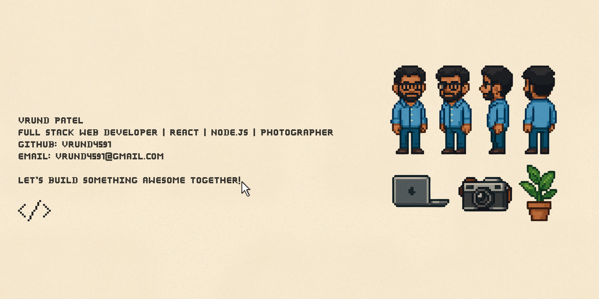

# Hey, I'm Vrund Patel! 👋👨🏻‍💻

I'm a **full-stack developer** and **photographer** who loves turning ideas into purposeful digital experiences — and occasionally capturing the world through a lens. Passionate about open-source, environmental causes, visual storytelling, and tech that actually makes a difference. If there's a hackathon happening, I'm probably already in it. ⚡

---

## 🛠️ Here's what I wield to craft cool projects

  
  
  
  
  
  
  
  
  
  
  
  
  
  
  
  
  
  
  
  
  
  
  
  
  
  
  

---

## 🏆 Highlights

- 🏁 **Odoo Hackathon 2025 — Finalist** *(Asia's Largest Hiring Hackathon)*
- 🏁 **AutonomousHacks (Google Developers) — Finalist**
- 🎬 **Cinematographer & Photographer — Xenesis 2024 & 2025**
- 🤖 **Google Gen AI Exchange Program — Certified**
- 🐍 **NPTEL Certified — Java Programming**
- 💻 **Microsoft Hour of Code 2022**
- 🔁 **Odoo Hackathons — Multiple-time Finalist**

---

## 🌱 Fun Facts

- 📸 I tell stories with both **code and a camera**
- ⚡ Always hyped for the next **hackathon** challenge
- 🤝 Love **sharing knowledge** and vibing with the dev community
- 🌿 Quietly passionate about **tech for environmental good**

---

Let's connect and build something awesome together! 😄

